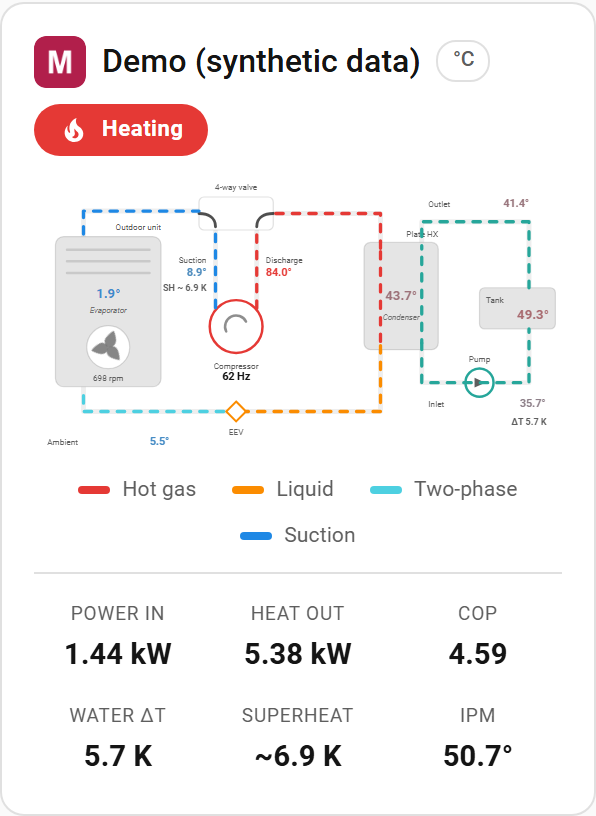
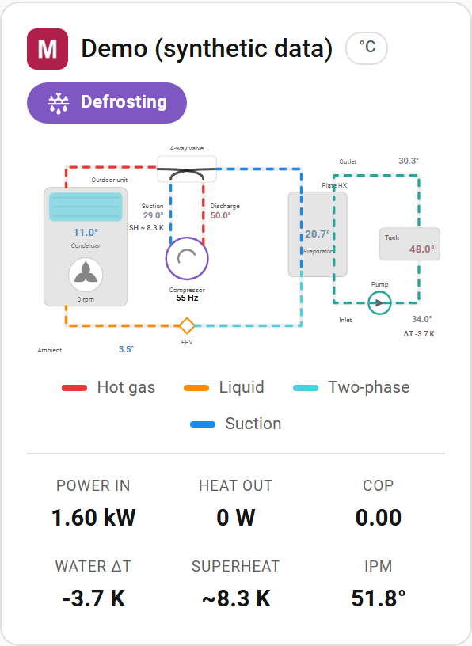
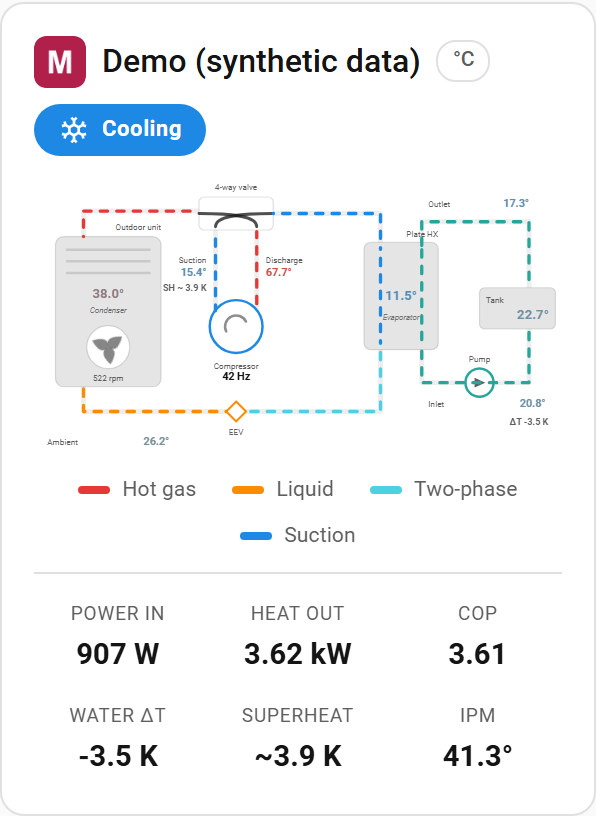

# Macon Heat Pump Controller

Home Assistant integration for the
[**Arctic Controller**](https://github.com/sslivins/arctic-controller) — a
custom, self-built controller for Macon heat pumps. It talks to the Arctic
Controller hardware/firmware, **not** the OEM Macon controller, and is not
affiliated with or endorsed by Macon. It pairs one local controller per config
entry and exposes its reported state, exact working modes, temperatures,
setpoints, diagnostics, and command controls.

> **Compatibility:** This integration only works with the
> [Arctic Controller](https://github.com/sslivins/arctic-controller) (the
> DIY/self-built controller). It does not support the stock OEM Macon
> controller.

The integration uses [`pymacon`](https://github.com/sslivins/pymacon) for
pinned-TLS REST and WebSocket transport. Commands are not optimistic:
Home Assistant updates only from controller-reported snapshots.

## Install with HACS

1. Open HACS and add `sslivins/hass-macon` as a custom integration repository.
2. Install **Macon Heat Pump Controller**.
3. Restart Home Assistant.
4. Add the integration from **Settings → Devices & services**.

## Manual install

Copy `custom_components/macon/` into the `custom_components/` directory of
your Home Assistant configuration, restart Home Assistant, and add the
integration.

## Discovery and compatibility

Physical pairing verifies the displayed one-time code and SHA-256 TLS
fingerprint. Multiple controllers are isolated from one another, and
credential or certificate changes trigger reauthentication.

The firmware's zeroconf service type (`_arctic._tcp.local.`), discovery
property (`arctic-controller`), and `arctic-*` device IDs are the Arctic
Controller's own wire-format identifiers. This integration targets the Arctic
Controller only and makes no claim to support OEM Macon controllers.

## Sensors and fault reporting

Alongside the climate control and the operational sensors (tank/outlet/inlet
temperatures, setpoints, power, COP, and — as diagnostic entities — compressor
frequency, fan speed/level, expansion valve position, AC voltage/current, DC bus
voltage, and the refrigerant-circuit temperatures), the
integration exposes a **Fault code** sensor. Its state is the stable Arctic
Controller fault code (for example `P02`) of the highest-severity active fault,
`ok` when the unit is healthy, or `unknown` for an unrecognised code. The
human-readable text is available on the sensor's `description` attribute, and
Home Assistant's own History/Logbook provides the fault timeline.

**Expansion valve position** is reported in raw steps, as the mainboard
publishes no full-scale step count and therefore no meaningful percentage. It,
along with the electrical readings, reports `unknown` rather than `0` when the
controller has not read the register — for the valve, `0` steps is a real state
meaning fully closed. Reading these requires controller firmware new enough to
publish them; older firmware simply leaves the entities `unknown`.

A `macon_fault` event is fired whenever a fault begins, clears, or changes:

```yaml
event_type: macon_fault
data:
  device_id: arctic-xxxxxxxx
  active: true
  code: P02
  name: HIGH_PRESSURE
  description: High pressure protection activated
  severity: critical
```

When a fault clears, `active` is `false` and `code` is `null`. Use the event in
automations to send a notification with the exact code and description.

## Heat pump dashboard card

The integration ships a custom Lovelace card that draws the unit as a live
refrigerant loop: compressor, 4-way reversing valve, EEV, the outdoor coil, and
the plate heat exchanger where the water side meets the refrigerant.



The loop re-routes and recolours itself as the unit changes mode:

| Defrost | Cooling |
| --- | --- |
|  |  |

The card registers itself — there is **no** resource to add under
*Settings → Dashboards → Resources*. Restart Home Assistant after upgrading,
then add it to a dashboard:

```yaml
type: custom:macon-heat-pump-card
title: Heat pump
```

| Option | Default | Description |
| --- | --- | --- |
| `title` | `Heat pump` | Card heading. Useful when you run more than one unit. |
| `device_id` | auto | Controller device id to bind to. Auto-detected when a single controller is configured. |
| `demo` | `false` | Render synthetic data cycling heating → defrost → cooling. Handy for previewing the card without a running unit. |

What it shows:

- **Flow direction and refrigerant state.** Pipe segments are coloured by
  thermodynamic state — hot gas, liquid, two-phase, and suction — and recolour
  themselves when the reversing valve flips, so heating, cooling, and defrost
  are visually distinct. Flow animates only while the compressor is running.
- **Component status.** The fan spins, the water pump and compressor highlight
  when energised, and a frost overlay appears on the outdoor coil during
  defrost.
- **Live temperatures** at each point in the circuit, plus power input, thermal
  output, COP, and the water-side ΔT across the heat exchanger.
- **Expansion valve position**, in valve steps. The controller does not publish
  the valve's full-scale step count, so this is deliberately shown as a raw step
  count rather than a percentage or a fill gauge — there is no honest way to
  scale it without knowing the maximum.
- Clicking any value opens the underlying entity's more-info dialog.

### A note on the superheat figure

Superheat is shown as `SH ~` — the tilde is deliberate. True superheat is
suction temperature minus the *saturated* evaporating temperature, which is
derived from suction pressure. The Arctic controller has no pressure
transducer (only high/low pressure protection switches), so the card uses the
standard coil-thermistor approximation instead: suction temperature minus the
evaporating coil temperature, selecting the outdoor coil in heating and the
plate heat exchanger in cooling and defrost. It is suppressed entirely while
the compressor is stopped, where the value would be meaningless.

Treat it as a **trend indicator, not a calibrated measurement** — accuracy
depends on where the coil thermistor is physically mounted. A value that drifts
steadily over weeks is still a genuine signal.

## Development

```powershell
python -m pip install -e ".[tests]"
ruff check custom_components/macon tests
mypy custom_components/macon
pytest
```

Home Assistant test dependencies are installed by the test extra. The test
extra tracks the `pymacon` repository; the integration manifest pins the
runtime dependency to `pymacon==0.2.2`.

### Continuous integration

`main` is protected: a pull request must pass **unit-tests** and
**Hassfest** before it can merge, and the branch must be up to date with
`main`. Arming auto-merge is still fine -- protection simply holds the
merge until the checks report.

The gating also removes a systemic false failure. `HACS validation` used
to fail on *every* pull request while succeeding on every push to `main`.
With no required checks, auto-merge landed a PR seconds after it opened
and `--delete-branch` removed the head ref before `hacs/action` resolved
it, so the action reported `Repository ... not loaded properly in HACS /
Not Found`. The head branch now survives until the checks finish.

## License

[MIT](LICENSE) © [sslivins](https://github.com/sslivins)
